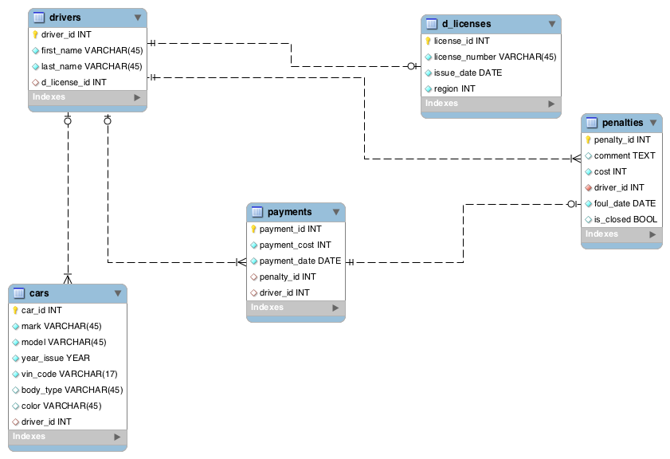

db-coursework
=============
=============
##Схема:

------------------------

1. [Drivers](https://github.com/svyd/db-coursework/blob/master/README.md#drivers)
2. [Cars](https://github.com/svyd/db-coursework/blob/master/README.md#cars)
3. [Payments](https://github.com/svyd/db-coursework/blob/master/README.md#payments)
4. [d_licenses](https://github.com/svyd/db-coursework/blob/master/README.md#d_licenses)
5. [Penalties](https://github.com/svyd/db-coursework/blob/master/README.md#penalties)

------------------------
#Описание
------------------------
### drivers
1. driver_id
2. first_name
3. last_name
4. d_license_id
------------------------
### cars
1. car_id
2. mark
3. model
4. year_issue
5. vin_code
6. body_type
7. color
8. driver_id
------------------------
### payments
1. payment_id
2. payment_cost
3. payment_date
4. penalty_id
5. driver_id
------------------------
### d_licenses
1. license_id
2. license_number
3. issue_date
4. region
------------------------
### penalties
1. penalty_id
2. comment 
3. cost
4. driver_id
5. foul_date
6. is_closed
------------------------
