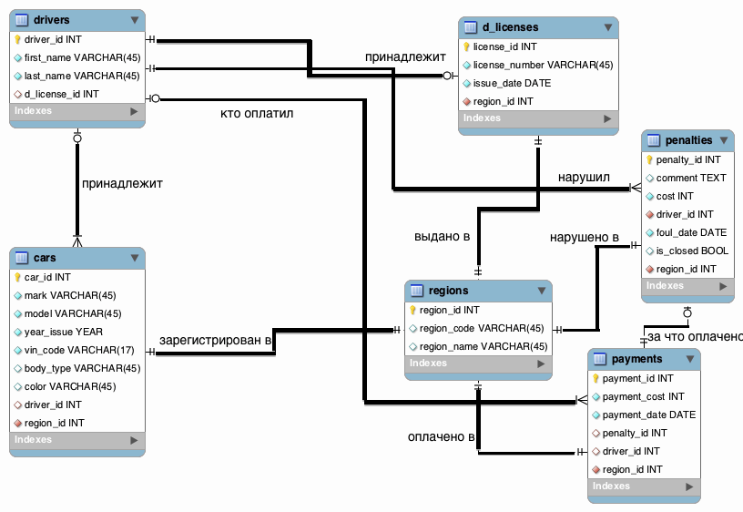

db-coursework
=============
=============
##Схема:



------------------------

#Данные
1. [Drivers](https://github.com/svyd/db-coursework/blob/master/README.md#drivers)
2. [Cars](https://github.com/svyd/db-coursework/blob/master/README.md#cars)
3. [Payments](https://github.com/svyd/db-coursework/blob/master/README.md#payments)
4. [d_licenses](https://github.com/svyd/db-coursework/blob/master/README.md#d_licenses)
5. [Penalties](https://github.com/svyd/db-coursework/blob/master/README.md#penalties)
6. [regions](https://github.com/svyd/db-coursework/blob/master/README.md#regions)

#Хранимые процедуры

Помечаем штраф с заданным id как оплаченный
```sql
DELIMITER $$

CREATE PROCEDURE `remove_penalty_by_payment` (IN var1 INT)
BEGIN
	UPDATE penalties SET is_closed = true where penalties.penalty_id = var1;
END

```

#Триггеры

1. После успешного добавления платежа вызываем процедуру, которая пометит нужный штраф как проплаченный

```sql
USE `mydb`;
DROP trigger IF EXISTS `mydb`.`remove_penalty_trigger`;

DELIMITER $$

CREATE TRIGGER `remove_penalty_trigger` AFTER INSERT ON payments
for each row
BEGIN
        call remove_penalty_by_payment(new.penalty_id);
END$$

DELIMITER ;
```
2. Проверка входящего платежа  перед добавлением (есть ли подходящие под этот платеж штрафы)

```sql
USE `mydb`;
DROP trigger IF EXISTS `mydb`.`check_payment_trigger`;

DELIMITER $$

CREATE TRIGGER `check_payment_trigger` BEFORE INSERT ON payments
for each row
BEGIN
        SET @is_good := EXISTS(SELECT * FROM penalties WHERE
                penalties.cost = new.payment_cost and
                penalties.penalty_id = new.penalty_id
                and penalties.driver_id = new.driver_id);
        if @is_good = 0 then
                set @msg = "Bad payment";
                SIGNAL SQLSTATE '45000' SET MESSAGE_TEXT = @msg;
        end if;
END$$


DELIMITER ;
```
Пример использования(на исходных данных):

некорректный платеж
```sql
insert into payments(payment_cost, payment_date, penalty_id, driver_id, region_id) values (500, '2012-09-20', 2, 1, 2);
```

корректный
```
insert into payments(payment_cost, payment_date, penalty_id, driver_id, region_id) values (1500, '2012-09-20', 2, 4, 2);
```


3. Проверка того факта, что длинна vin-кода составляет именно 17 символов (При добавлении)

```sql
DROP trigger IF EXISTS `mydb`.`check_cars_trigger`;
DELIMITER $$
CREATE TRIGGER `check_cars_trigger` BEFORE INSERT ON cars
for each row
BEGIN
        if length(new.vin_code) <> 17 then
                set @msg = "Bad vin_code";
                SIGNAL SQLSTATE '45000' SET MESSAGE_TEXT = @msg;
        end if;
END$$

DELIMITER ;
```


------------------------
#Описание
------------------------
### drivers (Водитель)
1. driver_id (идентификатор водителя)
2. first_name (имя водителя)
3. last_name (фамилия водителя)
4. d_license_id (идентификатор в/у водителя)

```sql
CREATE TABLE IF NOT EXISTS `mydb`.`drivers` (
  `driver_id` INT NOT NULL AUTO_INCREMENT,
  `first_name` VARCHAR(45) NOT NULL,
  `last_name` VARCHAR(45) NOT NULL,
  `d_license_id` INT NULL,
  PRIMARY KEY (`driver_id`),
  UNIQUE INDEX `iddriver_UNIQUE` (`driver_id` ASC),
  INDEX `fk_drivers_d_licenses_idx` (`d_license_id` ASC),
  CONSTRAINT `fk_drivers_d_licenses`
    FOREIGN KEY (`d_license_id`)
    REFERENCES `mydb`.`d_licenses` (`license_id`)
    ON DELETE SET NULL
    ON UPDATE NO ACTION)
ENGINE = InnoDB
```
------------------------
### cars (Автомобиль)
1. car_id (идентификатор автомобиля)
2. mark (марка автомобиля)
3. model (модель автомобиля)
4. year_issue (год выпуска автомобиля)
5. vin_code (vehicle identification number)
6. body_type (тип кузова автомобиля)
7. color (цвет автомобиля)
8. driver_id (идентификатор владельца автомобиля - водителя)
9. region_id (идентификатор региона, в котором зарегистрирован автомобиль)

```sql
CREATE TABLE IF NOT EXISTS `mydb`.`cars` (
  `car_id` INT UNSIGNED NOT NULL AUTO_INCREMENT,
  `mark` VARCHAR(45) NOT NULL,
  `model` VARCHAR(45) NOT NULL,
  `year_issue` YEAR NOT NULL,
  `vin_code` VARCHAR(17) NOT NULL,
  `body_type` VARCHAR(45) NULL,
  `color` VARCHAR(45) NULL,
  `driver_id` INT NULL,
  PRIMARY KEY (`car_id`),
  UNIQUE INDEX `vin_code_UNIQUE` (`vin_code` ASC),
  INDEX `fk_cars_drivers1_idx` (`driver_id` ASC),
  CONSTRAINT `fk_cars_drivers1`
    FOREIGN KEY (`driver_id`)
    REFERENCES `mydb`.`drivers` (`driver_id`)
    ON DELETE SET NULL
    ON UPDATE SET NULL)
ENGINE = InnoDB
```

------------------------
### payments (Платежи)
1. payment_id (идентификатор платежа)
2. payment_cost (сумма платежа)
3. payment_date (дата проведения платежа)
4. penalty_id (идентификатор штрафа - назначение плвтежа)
5. driver_id (идентификатор нарушителя-водителя - кто оплачивает штраф)
6. region_id (идентификатор региона, в котором осуществлен платеж)

```sql
CREATE TABLE IF NOT EXISTS `mydb`.`payments` (
  `payment_id` INT NOT NULL AUTO_INCREMENT,
  `payment_cost` INT NOT NULL,
  `payment_date` DATE NOT NULL,
  `penalty_id` INT NULL,
  `driver_id` INT NULL,
  PRIMARY KEY (`payment_id`),
  INDEX `fk_payments_penalties1_idx` (`penalty_id` ASC),
  INDEX `fk_payments_drivers1_idx` (`driver_id` ASC),
  CONSTRAINT `fk_payments_penalties1`
    FOREIGN KEY (`penalty_id`)
    REFERENCES `mydb`.`penalties` (`penalty_id`)
    ON DELETE SET NULL
    ON UPDATE SET NULL,
  CONSTRAINT `fk_payments_drivers1`
    FOREIGN KEY (`driver_id`)
    REFERENCES `mydb`.`drivers` (`driver_id`)
    ON DELETE NO ACTION
    ON UPDATE NO ACTION)
ENGINE = InnoDB
```

------------------------
### d_licenses (Водительские удостоверения)
1. license_id (идентефикатор в/у)
2. license_number (номер в/у)
3. issue_date (дата получения в/у)
4. region_id (идентификатор региона получения в/у)

```sql
CREATE TABLE IF NOT EXISTS `mydb`.`d_licenses` (
  `license_id` INT NOT NULL AUTO_INCREMENT,
  `license_number` VARCHAR(45) NOT NULL,
  `issue_date` DATE NOT NULL,
  `region` INT NOT NULL,
  PRIMARY KEY (`license_id`),
  UNIQUE INDEX `license_id_UNIQUE` (`license_id` ASC),
  UNIQUE INDEX `license_number_UNIQUE` (`license_number` ASC))
ENGINE = InnoDB
```

------------------------
### penalties (Штрафы за нарушения)
1. penalty_id (идентификатор штрафа)
2. comment (условный комментарий ("за что штраф"))
3. cost (величина штрафа)
4. driver_id (идентификатор нарушителя - водителя)
5. foul_date (дата получения штрафа)
6. is_closed (оплачен ли штраф)
7. region_id (регион, в котором назначен штраф)

```sql
CREATE TABLE IF NOT EXISTS `mydb`.`penalties` (
  `penalty_id` INT NOT NULL AUTO_INCREMENT,
  `comment` TEXT NULL,
  `cost` INT NOT NULL,
  `driver_id` INT NOT NULL,
  `foul_date` DATE NOT NULL,
  `is_closed` TINYINT(1) NULL DEFAULT FALSE,
  PRIMARY KEY (`penalty_id`),
  INDEX `fk_penalty_drivers1_idx` (`driver_id` ASC),
  INDEX `date_index` USING BTREE (`foul_date` ASC),
  CONSTRAINT `fk_penalty_drivers1`
    FOREIGN KEY (`driver_id`)
    REFERENCES `mydb`.`drivers` (`driver_id`)
    ON DELETE NO ACTION
    ON UPDATE NO ACTION)
ENGINE = InnoDB
```

------------------------

### regions (Регионы)

1. region_id (идентификатор региона)
2. region_code (код региона)
3. region_name (название региона)


------------------------
### Views

```sql

DROP VIEW IF EXISTS `mydb`.`view_drivers_and_licenses` ;
DROP TABLE IF EXISTS `mydb`.`view_drivers_and_licenses`;
USE `mydb`;
CREATE  OR REPLACE VIEW `view_drivers_and_licenses` AS
SELECT 
drivers.driver_id as 'driver_id',
drivers.first_name as 'first_name',
drivers.last_name as 'last_name',
d_licenses.license_number as 'license_number',
d_licenses.issue_date as 'license_issue_date' FROM drivers 
INNER JOIN d_licenses on drivers.d_license_id = d_licenses.license_id;

DROP VIEW IF EXISTS `mydb`.`view_drivers_and_cars` ;
DROP TABLE IF EXISTS `mydb`.`view_drivers_and_cars`;
USE `mydb`;
CREATE  OR REPLACE VIEW `view_drivers_and_cars` AS
select 
drivers.driver_id as 'driver_id',
drivers.first_name as 'first_name',
drivers.last_name as 'last_name',
cars.car_id as 'car_id',
cars.mark as 'mark',
cars.model as 'model',
cars.year_issue as 'year',
cars.color as 'color', 
cars.vin_code as 'vin' 
from drivers inner join cars on drivers.driver_id = cars.driver_id;

DROP VIEW IF EXISTS `mydb`.`view_drivers_cars_licenses` ;
DROP TABLE IF EXISTS `mydb`.`view_drivers_cars_licenses`;
USE `mydb`;
CREATE  OR REPLACE VIEW `view_drivers_cars_licenses` AS
select
drivers.driver_id as 'driver_id', 
drivers.first_name as 'first_name',
drivers.last_name as 'last_name',
cars.mark as 'mark',
cars.model as 'model',
cars.year_issue as 'year',
cars.color as 'color', 
cars.vin_code as 'vin',
d_licenses.license_number as 'license_number',
d_licenses.issue_date as 'license_issue_date' 
from drivers 
inner join d_licenses on drivers.d_license_id = d_licenses.license_id 
inner join cars on drivers.driver_id = cars.driver_id;

DROP VIEW IF EXISTS `mydb`.`view_penalty_with_all` ;
DROP TABLE IF EXISTS `mydb`.`view_penalty_with_all`;
USE `mydb`;
CREATE  OR REPLACE VIEW `view_penalty_with_all` AS
select 
drivers.driver_id as 'driver_id',
drivers.first_name as 'first_name',
drivers.last_name as 'last_name',
cars.mark as 'mark',
cars.model as 'model',
cars.year_issue as 'year',
cars.color as 'color', 
cars.vin_code as 'vin',
d_licenses.license_number as 'license_number',
d_licenses.issue_date as 'license_issue_date',
penalties.comment as 'comment',
penalties.foul_date as 'foul_date',
penalties.cost as 'cost' 
from drivers 
inner join cars on drivers.driver_id = cars.driver_id
inner join penalties on drivers.driver_id = penalties.driver_id
LEFT OUTER join d_licenses 
on drivers.d_license_id = d_licenses.license_id where penalties.is_closed = FALSE;


DROP VIEW IF EXISTS `mydb`.`view_drivers_without_license` ;
DROP TABLE IF EXISTS `mydb`.`view_drivers_without_license`;
USE `mydb`;
CREATE  OR REPLACE VIEW `view_drivers_without_license` AS
select 
drivers.driver_id as 'driver_id',
drivers.first_name as 'first_name',
drivers.last_name as 'last_name' 
from drivers where drivers.d_license_id is NULL; 
;

DROP VIEW IF EXISTS `mydb`.`view_closed_penalty_with_all` ;
DROP TABLE IF EXISTS `mydb`.`view_closed_penalty_with_all`;
USE `mydb`;
CREATE  OR REPLACE VIEW `view_closed_penalty_with_all` AS
select 
drivers.driver_id as 'driver_id',
drivers.first_name as 'first_name',
drivers.last_name as 'last_name',
cars.mark as 'mark',
cars.model as 'model',
cars.year_issue as 'year',
cars.color as 'color', 
cars.vin_code as 'vin',
d_licenses.license_number as 'license_number',
d_licenses.issue_date as 'license_issue_date',
penalties.comment as 'comment',
penalties.foul_date as 'foul_date',
penalties.cost as 'cost' 
from drivers 
inner join cars on drivers.driver_id = cars.driver_id
inner join penalties on drivers.driver_id = penalties.driver_id
LEFT OUTER join d_licenses 
on drivers.d_license_id = d_licenses.license_id where penalties.is_closed = TRUE;

```
----------------------------

### DATA

```sql
START TRANSACTION;
USE `mydb`;
INSERT INTO `mydb`.`d_licenses` (`license_id`, `license_number`, `issue_date`, `region_id`) VALUES (1, '3503649015', '2011-08-20', 1);
INSERT INTO `mydb`.`d_licenses` (`license_id`, `license_number`, `issue_date`, `region_id`) VALUES (2, '1234567890', '1992-05-25', 2);
INSERT INTO `mydb`.`d_licenses` (`license_id`, `license_number`, `issue_date`, `region_id`) VALUES (3, '3214567742', '2012-12-31', 4);
INSERT INTO `mydb`.`d_licenses` (`license_id`, `license_number`, `issue_date`, `region_id`) VALUES (4, '3232323234', '2004-03-03', 3);

COMMIT;


START TRANSACTION;
USE `mydb`;
INSERT INTO `mydb`.`drivers` (`driver_id`, `first_name`, `last_name`, `d_license_id`) VALUES (1, 'Svyatoslav', 'Demidov', 1);
INSERT INTO `mydb`.`drivers` (`driver_id`, `first_name`, `last_name`, `d_license_id`) VALUES (2, 'Petrov', 'Ivan', 2);
INSERT INTO `mydb`.`drivers` (`driver_id`, `first_name`, `last_name`, `d_license_id`) VALUES (3, 'Sidorov', 'Petr', 3);
INSERT INTO `mydb`.`drivers` (`driver_id`, `first_name`, `last_name`, `d_license_id`) VALUES (4, 'Miron', 'Mironov', NULL);
INSERT INTO `mydb`.`drivers` (`driver_id`, `first_name`, `last_name`, `d_license_id`) VALUES (5, 'Anton', 'Antonov', 4);

COMMIT;


START TRANSACTION;
USE `mydb`;
INSERT INTO `mydb`.`cars` (`car_id`, `mark`, `model`, `year_issue`, `vin_code`, `body_type`, `color`, `driver_id`, `region_id`) VALUES (1, 'BMW', 'X5', 2005, 'WBACS11020FR83379', 'CROSSOVER', 'BLACK', 1, 1);
INSERT INTO `mydb`.`cars` (`car_id`, `mark`, `model`, `year_issue`, `vin_code`, `body_type`, `color`, `driver_id`, `region_id`) VALUES (2, 'VOLKSWAGEN', 'GOLF', 2011, 'CDBEW12060EC53335', 'HATCHBACK', 'GREEN', 1, 2);
INSERT INTO `mydb`.`cars` (`car_id`, `mark`, `model`, `year_issue`, `vin_code`, `body_type`, `color`, `driver_id`, `region_id`) VALUES (3, 'VAZ', '2115', 2005, 'CDBEW12063RC53335', 'SEDAN', 'SILVER', 2, 3);
INSERT INTO `mydb`.`cars` (`car_id`, `mark`, `model`, `year_issue`, `vin_code`, `body_type`, `color`, `driver_id`, `region_id`) VALUES (4, 'ALPINA', 'B6', 2013, 'WVESFEWSFEWQERDFD', 'COUPE', 'RED', 4, 4);
INSERT INTO `mydb`.`cars` (`car_id`, `mark`, `model`, `year_issue`, `vin_code`, `body_type`, `color`, `driver_id`, `region_id`) VALUES (5, 'BMW', '3ER', 1999, 'DDDDDDDDDDDDDDDDD', 'HATCHBACK', 'SILVER', 5, 2);

COMMIT;

START TRANSACTION;
USE `mydb`;
INSERT INTO `mydb`.`penalties` (`penalty_id`, `comment`, `cost`, `driver_id`, `foul_date`, `is_closed`, `region_id`) VALUES (1, 'Превышение скорости на 10 км/ч', 500, 2, '2012-08-20', FALSE, 1);
INSERT INTO `mydb`.`penalties` (`penalty_id`, `comment`, `cost`, `driver_id`, `foul_date`, `is_closed`, `region_id`) VALUES (2, 'Езда без прав', 1500, 4, '2011-05-03', FALSE, 2);
INSERT INTO `mydb`.`penalties` (`penalty_id`, `comment`, `cost`, `driver_id`, `foul_date`, `is_closed`, `region_id`) VALUES (3, 'Нарушение правил парковки', 2000, 3, '2013-04-24', FALSE, 1);

COMMIT;

```
